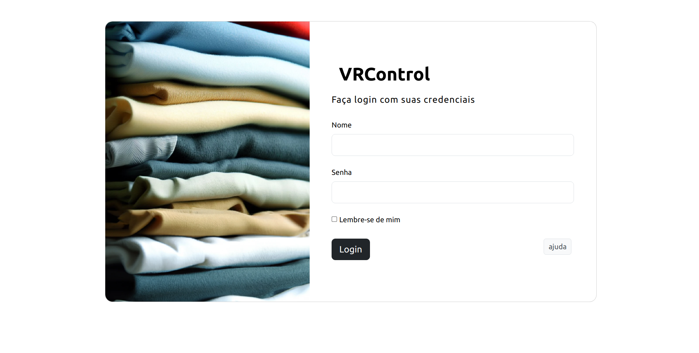
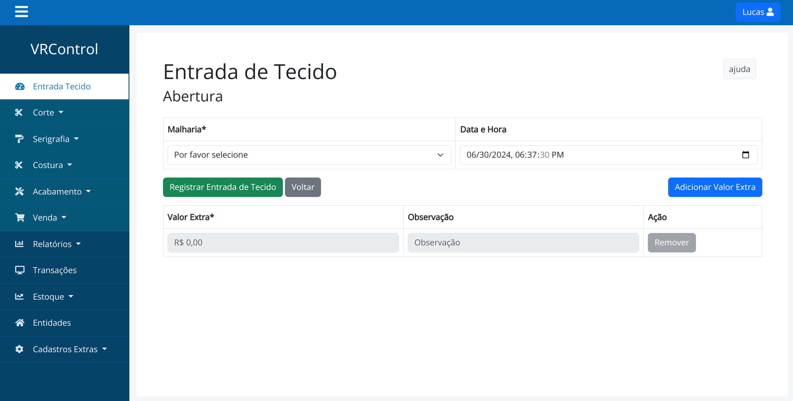

# VR CONTROL

[English Version](#vr-control---english-version)

Este é um sistema de gestão desenvolvido para uma empresa de produção de roupas, cobrindo todas as fases do processo, desde a aquisição de matéria-prima até a distribuição final. O sistema possui controle total do processo produtivo, incluindo terceirização e gerenciamento de estoque de matéria-prima e produtos acabados. Este projeto foi desenvolvido como parte do Trabalho de Conclusão de Curso (TCC) da faculdade de sistemas (2023).

## Instruções para rodar a aplicação

Para iniciar a aplicação, siga os passos abaixo:

1. Certifique-se de ter o Git e Docker instalados no seu sistema.
2. Clone o repositório do projeto:

```bash
git clone https://github.com/olucasaguilar/vrcontrol
```

3. Navegue até o diretório do projeto:

```bash
cd vrcontrol
```

4. Execute o seguinte comando para criar e iniciar os contêineres necessários:

```bash
docker-compose up
```

Isso irá criar e iniciar os contêineres necessários para a aplicação, e ela estará pronta para ser acessada na rota [localhost:3000](http://localhost:3000).

## Acesso à aplicação

- URL: [localhost:3000](http://localhost:3000)
- Login: `Lucas`
- Senha: `123456`

## Telas da aplicação

### Tela de login


### Exemplo da tela de Entrada de Tecido


# VR CONTROL - English Version

This is a management system developed for a clothing production company, covering all stages of the process, from raw material acquisition to final distribution. The system provides full control over the production process, including outsourcing and inventory management of raw materials and finished products. This project was developed as part of a college capstone project (2023).

## Instructions to Run the Application

To start the application, follow the steps below:

1. Ensure you have Git and Docker installed on your system.
2. Clone the project repository:

```bash
git clone https://github.com/olucasaguilar/vrcontrol
```

3. Navigate to the project directory:

```bash
cd vrcontrol
```

4. Run the following command to create and start the necessary containers:

```bash
docker-compose up
```

This will create and start the necessary containers for the application, and it will be ready to be accessed at [localhost:3000](http://localhost:3000).

## Access to the Application

- URL: [localhost:3000](http://localhost:3000)
- Login: `Lucas`
- Password: `123456`

## Application Screens

### Login Screen


### Example of the Fabric Entry Screen
